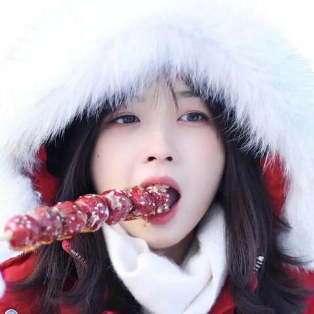

# PaintTransformer-Pytorch-,aster

hi, guys!<br/>
this is a conversion of the `paddle` implementation of the paper [Paint Transformer: Feed Forward Neural Painting with Stroke Prediction](http://arxiv.org/abs/2108.03798) (ICCV 2021, oral). Here are the [project site 🌐](https://github.com/Huage001/PaintTransformer) and the [official codes 💻](https://github.com/wzmsltw/PaintTransformer).<br/>
|Target Image|From `Pytorch` | From `Paddle` |
|--|--|--|
||  ||

## 1. Simple Start
Try to run 
```sh
python inference.py 
```
and check the output frames in `./sampels/outputs/bingbing/`.<br/>
Goto `./samples/outputs/` and run 
```sh
python frames2mp4.py
```
to merge the frames into a video.
## 2. Model Conversion
Run 
```sh
python paddle2pytorch.py
```
to convert the trained `paddle` checkpoints into `pytorch`. BTW, Remember to check the checkpoints paths.

## 3. Test on Yr Images.
Put yr images in `./samples/inputs/`, and modify the lines of #12 in `inference.py`.
```python
if __name__ == "__main__":
    ## files
    input_path = "samples/inputs/darling.jpg" # line# = 12
    output_dir = "samples/outputs/"
```
Just do as **Section 1**.

## 4. Attention
#### 4.1 Problems by `Pytorch` Versions
---
Notice that this codes are dubugged in `Pytorch-1.9.0`, and the input shape of transformer is in `(B,N,C)`, i.e., "batch first".<br/>
In `Pytorch` of earlier versions, no argument "batch_first" is defined. So you may try to modify the `network.py` as follows.
> 1) In `network.py` #39, change <br/>
> `self.transformer = nn.Transformer(hidden_dim, n_heads, n_enc_layers, n_dec_layers, batch_first=True)` ➡️ `self.transformer = nn.Transformer(hidden_dim, n_heads, n_enc_layers, n_dec_layers)`
> 2) In #72-74, change <br/>
> ```python
> src = (pos_embedding + feat.view(b, c, -1).permute(2, 0, 1)).permute(1, 0, 2)
> tgt = self.query_pos_embedding.unsqueeze(1).repeat(1, b, 1).permute(1, 0, 2)
> hidden_state = self.transformer(src, tgt)
> ```
> ➡️
> ```python
> src = (pos_embedding + feat.view(b, c, -1).permute(2, 0, 1))
> tgt = self.query_pos_embedding.unsqueeze(1).repeat(1, b, 1)
> hidden_state = self.transformer(src, tgt).permute(1, 0, 2) 
> ```
        
#### 4.2 A Difference Between `Pytorch` & `Paddle`
---
We have found that the APIs in `torch.nn.functional.affine_grid` and `paddle.nn.functional.affine_grid` outputs slightly differently when fed with the same input $\theta$'s.<br/>
Fortunately, this seems not to make negative effects on final results.

## 5. Training
MAYBE come ... 😄